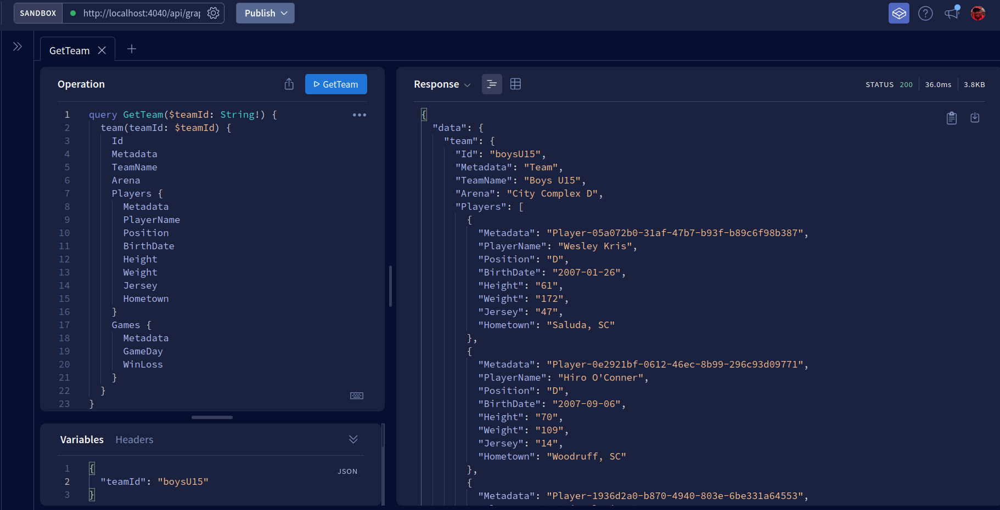
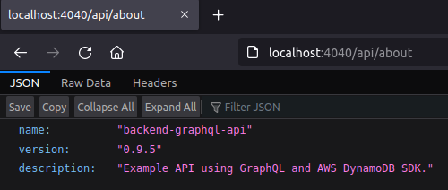

# Example JavaScript API

Example API using Express JS, Apollo Server, and Local Amazon DynamoDb.




TODO:
- Write more tests.
- Add token-based authentication.
- Add CI/CD w/ CircleCI.
- Create deployment container and ship it AWS Elastic Container Registry.
- Add delete mutations
- Utilize different types other than strings

## Pre-requisites

The installation instructions are targeting Debian-based distros (Ubuntu, Linux Mint, etc.) but they can also work under [Windows using the Windows Subsystem for Linux (WSL)](https://docs.microsoft.com/en-us/windows/wsl/about).  The following tools need to be installed:

- Install [direnv](https://direnv.net).
- Install [Docker](https://www.docker.com).
- Install [NodeJS](https://nodejs.org/en/download/).
- Install [AWS CLI](https://docs.aws.amazon.com/cli/latest/userguide/cli-chap-getting-started.html).

Note:  Once `direnv` is install, it's best to begin populating the `.envrc` file before moving forward.

```bash
cp .envrc.example .envrc && direnv allow
```

The base file should get you started but the following instructions should be followed to correctly get the environment variables set.

### Installing Node Version Manager (NVM)

```bash
wget -qO- https://raw.githubusercontent.com/nvm-sh/nvm/v0.35.3/install.sh | bash
echo 'export NVM_DIR="$HOME/.nvm"
[ -s "$NVM_DIR/nvm.sh" ] && \. "$NVM_DIR/nvm.sh"  # This loads nvm
[ -s "$NVM_DIR/bash_completion" ] && \. "$NVM_DIR/bash_completion"' >> ~/.bashrc
source ~/.bashrc
nvm install lts/* 
```

### Working with the DynamoDB Docker Container for Development

With Docker installed, execute `docker-compose pull && docker-compose up -d`.  Executing `npm run test` will generate the `Soccer-test` table to execute tests against.  To generate the `Soccer-development` table, you have 2 options:

With `NODE_ENV=development` declared, execute [the CLI shell script](./database/aws_cli_model_creation.sh) to generate the table based on the data model described within.  Afterwards, execute `npm run seed` to seed the database.

  Note: Alternatively, you can import the the [AWS NoSql Workbench](https://docs.aws.amazon.com/amazondynamodb/latest/developerguide/workbench.settingup.html).  To import the [NoSql Workbench JSON file](./database/nosql_workbench_model.json), go into the `Visualizer` and commit your database to your local DynamoDb.  After you've created a connection to complete the previous step, go to the `Operation Building` and grab the credentials NoSql Workbench created for the connection (see the key icon near the `Name` field).  Once you have the credentials, add them to ~/.aws/credentials file under a new profile called `localhost-user`.  

You can test your connection executing the following queries:

```bash
aws dynamodb describe-table \
  --endpoint-url http://localhost:${DYNAMODB_PORT} \
  --table-name Soccer-development \
  --profile localhost-user \
  --region localhost

aws dynamodb query \
  --endpoint-url http://localhost:${DYNAMODB_PORT} \
  --table-name Soccer-development \
  --index-name 'MetadataIndex' \
  --projection-expression 'Metadata, TeamName, Abbreviation, Arena' \
  --key-condition-expression "Metadata = :v1" \
  --expression-attribute-values '{ ":v1":{"S":"Team"} }' \
  --profile localhost-user \
  --region localhost
```

## Getting Site Up & Running

Finally, it's time to start the AP.  This can be done by executing the following:

```bash
nvm use                  # use the version of NodeJS listed in .nvmrc
npm i                    # install the packages listed in package.json
npm run start            # starts executing website on http://localhost:$PORT
```
