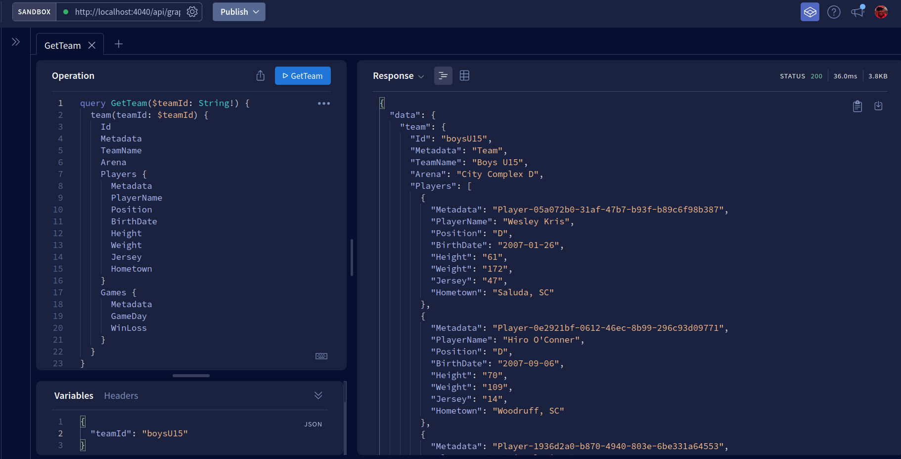
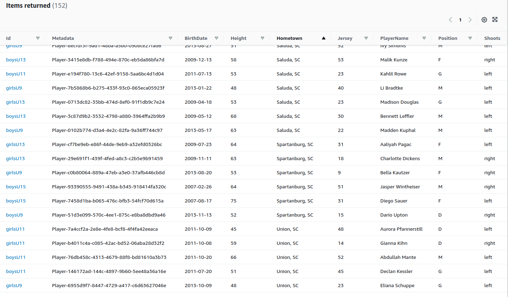

# Example Serverless JavaScript API

Serverless Example API using Express JS, Apollo Server, and AWS (API Gateway + DynamoDb + Lambda).



_TODO_:

- Write more tests, especially early to identify change points.
- Add delete mutations
- Utilize different types other than strings

## Pre-requisites

The installation instructions are targeting Debian-based distros (Ubuntu, Linux Mint, etc.) but they can also work under [Windows using the Windows Subsystem for Linux (WSL)](https://docs.microsoft.com/en-us/windows/wsl/about).  The following tools need to be installed:

- Install [direnv](https://direnv.net).
- Install [Docker](https://www.docker.com).
- Install [NodeJS](https://nodejs.org/en/download/).
- Install [AWS CLI](https://docs.aws.amazon.com/cli/latest/userguide/cli-chap-getting-started.html).
- For deployments to AWS, a [Serverless account](https://app.serverless.com/).

### Installing Node Version Manager (NVM)

```bash
wget -qO- https://raw.githubusercontent.com/nvm-sh/nvm/v0.35.3/install.sh | bash
echo 'export NVM_DIR="$HOME/.nvm"
[ -s "$NVM_DIR/nvm.sh" ] && \. "$NVM_DIR/nvm.sh"  # This loads nvm
[ -s "$NVM_DIR/bash_completion" ] && \. "$NVM_DIR/bash_completion"' >> ~/.bashrc
source ~/.bashrc
nvm install lts/fermium # Node 14x because Amazon hasn't upgraded their framework yet :( 
```

## Getting Site Up & Running for the first time

Finally, it's time to start the application.  This can be done by executing the following:

```bash
nvm use                         # use the version of NodeJS listed in .nvmrc
npm i -g serverless             # installs Serverless globally to your lts/fermium install

npm i && npm audit fix          # install the packages listed in package.json.

cp docs/.envrc.example .envrc   # Set your environment variables in .envrc
direnv allow

docker-compose up -d            # Spin up the DynamoDb Docker container
npm run seed                    # create and seed the Soccer-development table

cp docs/serverless.yml.example serverless.yml  # set your Serverless 'org' in severless.yml

serverless login                # will open a browser

# Install the plugin to simulate AWS Lambda and API Gateway locally
serverless plugin install -n serverless-offline                     
serverless offline start --httpPort $API_PORT --region $AWS_REGION
```

You can now go to http://localhost:4040/api/about for a quick sanity check.


You can also use 'curl' in a terminal window to creat a team:

```bash
curl -X POST \
-H "Content-Type: application/json" \
-H "Authorization: Bearer $TOKEN_SECRET" \
-d '{
    "query":"mutation CreateTeam($input: CreateTeamInput!) { createTeam(input: $input) { Id Metadata TeamName Arena  } }",
    "variables": {"input":{"teamId":"test-team-1","teamName":"Test Team","arena":"Test Team Arena"}}
  }' \
http://localhost:4040/api/graphql
```

Which should result in:

```bash
{"data":{"createTeam":{"Id":"test-team-1","Metadata":"Team","TeamName":"Test Team","Arena":"Test Team Arena"}}}
```

Retrieving the created team should work as well:

```bash
curl -X POST \
-H "Content-Type: application/json" \
-H "Authorization: Bearer $TOKEN_SECRET" \
-d '{
    "query":"query { team(teamId: \"test-team-1\") { Id Metadata TeamName Arena  } }"
  }' \
http://localhost:4040/api/graphql
```

Should present:

```bash
{"data":{"team":{"Id":"test-team-1","Metadata":"Team","TeamName":"Test Team","Arena":"Test Team Arena"}}}
```

## Deploying to AWS

```bash

# Create an application on Serverless to hook your deployments to
serverless --org=<YOUR SERVERLESS ORG>      # creates the app on Serverless.com, but select 'no' to deploy
serverless deploy --stage staging           # run deploy step separately, we'll deploy to "staging".
```

After running deploy, you should see output similar to:

```bash
Deploying example-api-project to stage staging (us-east-1)

✔ Service deployed to stack example-api-project-staging-api (196s)

endpoint: ANY - https://xxxxxxxxxx.execute-api.us-east-1.amazonaws.com
functions:
  api: example-api-project-staging-api (766 kB)
```

You can also review in your Serverless org's dashboard.


Your API is public and can be invoked by anyone. Requiring a token in your requests will only allow authorized users to access the API.  Making requests to the example API's `/api/graphql` endpoint without the token will result in:

```bash
{"errors":["Context creation failed: You are not authorized to make requests to this API's GraphQL endpoints."]}
```

For more details, refer to [`httpApi` event docs](https://www.serverless.com/framework/docs/providers/aws/events/http-api/).

## Invocation

After successful deployment, you can do a quick sanity check by calling:

```bash
curl -X GET https://xxxxxx.execute-api.us-east-1.amazonaws.com/api/about
```

You can create a new team by calling the corresponding endpoint:

```bash
curl -X POST \
-H "Content-Type: application/json" \
-H "Authorization: Bearer $TOKEN_SECRET" \
-d '{
    "query":"mutation CreateTeam($input: CreateTeamInput!) { createTeam(input: $input) { Id Metadata TeamName Arena  } }",
    "variables": {"input":{"teamId":"test-team-1","teamName":"Test Team","arena":"Test Team Arena"}}
  }' \
https://xxxxxx.execute-api.us-east-1.amazonaws.com/api/graphql
```

Which should result in the following response:

```bash
{"data":{"createTeam":{"Id":"test-team-1","Metadata":"Team","TeamName":"Test Team","Arena":"Test Team Arena"}}}
```

Retrieving the created team should work as well:

```bash
curl -X POST \
-H "Content-Type: application/json" \
-H "Authorization: Bearer $TOKEN_SECRET" \
-d '{
    "query":"query { team(teamId: \"test-team-1\") { Id Metadata TeamName Arena  } }"
  }' \
https://xxxxxx.execute-api.us-east-1.amazonaws.com/api/graphql
```

Should present:

```bash
{"data":{"team":{"Id":"test-team-1","Metadata":"Team","TeamName":"Test Team","Arena":"Test Team Arena"}}}
```

## Seeding the Remote Staging Table

To seed the staging database, in .envrc change the `NODE_ENV` variable to staging and plug in the access key id, access key, and region for the AWS provider account you used when creating the Serverless app/service.  Once done, execute `direnv allow` to refresh the variables within your PATH and then execute `npm run seed`.  You should see similar fake data within your [AWS Console](https://console.aws.amazon.com/dynamodbv2/home).

_Note_:  This is a snippet from `MetadataPlayerIndex` results.



Also, definitely review your [Lambda application](https://console.aws.amazon.com/lambda/home) and [API Gateway](https://console.aws.amazon.com/apigateway/main) integration as well.
